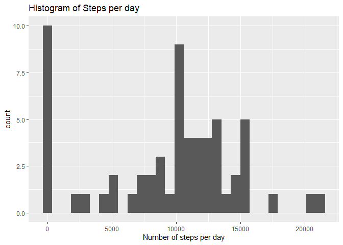
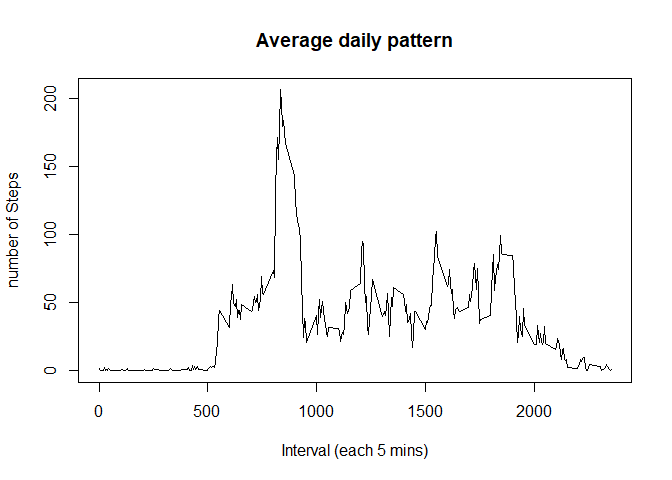
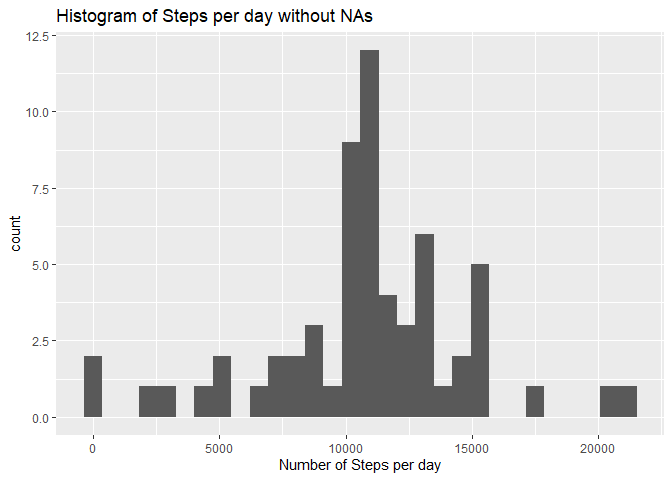
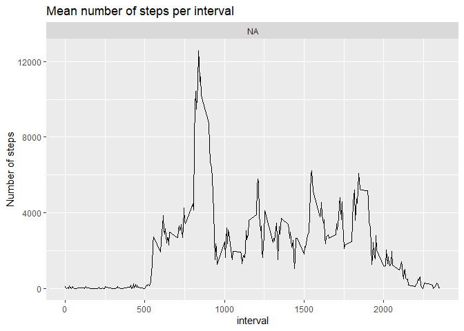

## Loading and preprocessing the data

We are going to use the tidyverse package in order to load and preprocess the data to create the activity tibble that we are going to use throughout the analysis.

1. Load the needed packages and the data (i.e. `read.csv()`)


```r
library(tidyverse)
```

```
## -- Attaching packages ------------------------------------------- tidyverse 1.2.1 --
```

```
## v ggplot2 3.2.1     v purrr   0.3.2
## v tibble  2.1.3     v dplyr   0.8.3
## v tidyr   0.8.3     v stringr 1.4.0
## v readr   1.3.1     v forcats 0.4.0
```

```
## -- Conflicts ---------------------------------------------- tidyverse_conflicts() --
## x dplyr::filter() masks stats::filter()
## x dplyr::lag()    masks stats::lag()
```

```r
setwd("~/GitHub/RepData_PeerAssessment1")
activity <- read_csv("activity.csv")
```

```
## Parsed with column specification:
## cols(
##   steps = col_double(),
##   date = col_date(format = ""),
##   interval = col_double()
## )
```

## What is mean total number of steps taken per day?

1. Make a histogram of the total number of steps taken each day


```r
temp <- activity %>% group_by(date) %>% summarise(steps.per.day = sum(steps,na.rm = TRUE))
ggplot(data = temp) + geom_histogram(aes(x =steps.per.day)) + labs(title = "Histogram of Steps per day") + xlab("Number of steps per day")
```

```
## `stat_bin()` using `bins = 30`. Pick better value with `binwidth`.
```

<!-- -->

2. Calculate and report the **mean** and **median** total number of steps taken per day
 

```r
mean <- mean(temp$steps.per.day)
median <- median(temp$steps.per.day)
```

The mean total number of steps per day is 9354.23 and the median total number of steps per day is: 1.0395\times 10^{4}.

## What is the average daily activity pattern?

1. Make a time series plot (i.e. `type = "l"`) of the 5-minute interval (x-axis) and the average number of steps taken, averaged across all days (y-axis)


```r
temp <- activity %>% group_by(interval) %>% summarise(mean.steps.per.interval = mean(steps,na.rm = TRUE))
plot(x = temp$interval, y = temp$mean.steps.per.interval, type = "l", main = "Average daily pattern",xlab = "Interval (each 5 mins)", ylab= "number of Steps")
```

<!-- -->

2. Which 5-minute interval, on average across all the days in the dataset, contains the maximum number of steps?


```r
max <- max(temp$mean.steps.per.interval)
interval <- temp %>% filter(mean.steps.per.interval == max) %>% select(interval)
```

We can identify that the maximun number of steps (206.1698113 steps) correspond to the interval number 835.

## Imputing missing values

1. Calculate and report the total number of missing values in the dataset (i.e. the total number of rows with `NA`s)


```r
mis <- sum(is.na(activity))
```

The total missing values of the dataset is: 2304.

2. Devise a strategy for filling in all of the missing values in the dataset. The strategy does not need to be sophisticated. For example, you could use the mean/median for that day, or the mean for that 5-minute interval, etc.

* Using the dplyr package I extract all the rows with missing values from the activity tibble, then I joint this tibble with the temporal tibble called "temp" using the "interval" column, then I assign the "mean.steps.per.interval" values to the steps variable and finally I select the columns that interest me (steps,date and interval). 

* The final step is to merge data with the new values and activity2 which contains all the rows form activity with no NAs in it.

3. Create a new dataset that is equal to the original dataset but with the missing data filled in.


```r
missing.val <- filter(activity, is.na(steps)) %>% left_join(temp,by="interval") %>% mutate(steps = mean.steps.per.interval) %>% select(steps,date,interval)
activity2 <- filter(activity, !is.na(steps)) 
activity2 <- bind_rows(activity2,missing.val)
```


4. Make a histogram of the total number of steps taken each day and Calculate and report the **mean** and **median** total number of steps taken per day. Do these values differ from the estimates from the first part of the assignment? What is the impact of imputing missing data on the estimates of the total daily number of steps?


```r
temp <- activity2 %>% group_by(date) %>% summarise(steps.per.day = sum(steps))
mean2 <- mean(temp$steps.per.day)
median2 <- median(temp$steps.per.day)
ggplot(data = temp) + geom_histogram(aes(x =steps.per.day)) + labs(title = "Histogram of Steps per day without NAs") + xlab("Number of Steps per day")
```

```
## `stat_bin()` using `bins = 30`. Pick better value with `binwidth`.
```

<!-- -->

The mean total number of steps per day is 1.076619\times 10^{4} and the median total number of steps per day is: 1.076619\times 10^{4}.

## Are there differences in activity patterns between weekdays and weekends?

1. Create a new factor variable in the dataset with two levels -- "weekday" and "weekend" indicating whether a given date is a weekday or weekend day.


```r
temp <- activity2 %>% mutate(weekday = weekdays(date)) %>% 
                        mutate(day.type = case_when(    weekday == "Monday" ~ "weekday",
                                                        weekday == "Tuesday" ~ "weekday",
                                                        weekday == "Wednesday" ~ "weekday",
                                                        weekday == "Thursday" ~ "weekday",
                                                        weekday == "Friday" ~ "weekday",
                                                        weekday == "Saturday" ~ "weekend",
                                                        weekday == "Sunday" ~ "weekend")) %>%
                        group_by(interval,day.type) %>% summarise(mean.steps.per.interval = sum(steps))
```

2. Make a panel plot containing a time series plot (i.e. `type = "l"`) of the 5-minute interval (x-axis) and the average number of steps taken, averaged across all weekday days or weekend days (y-axis). The plot should look something like the following, which was created using **simulated data**:


```r
ggplot(data = temp) + geom_line(aes(x = interval, y =mean.steps.per.interval)) + facet_wrap(~day.type,nrow = 2) + labs(title = "Mean number of steps per interval") + ylab("Number of steps")
```

<!-- -->
